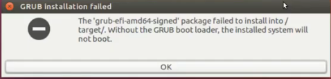
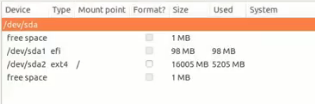
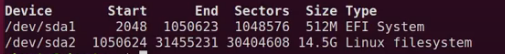
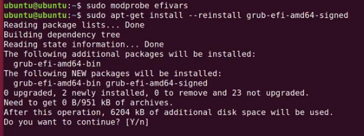
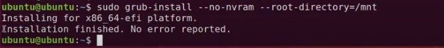
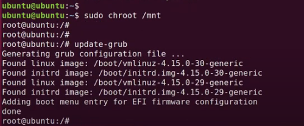

# /target/에 'grub-efi-amd64-signed' 패키지를 설치하는 데 실패했습니다

설치를 진행하는 도중에 GRUB 설치를 실패했다는 메시지를 만나는 경우가 있습니다.

## 부팅 USB를 이용하여 설치를 다시 진행하는 방법 

이 오류는 설치할 하드디스크의 파티션 구성이 필요한 조건을 만족하지 않는 경우에 발생하게 되는데

하모니카 3.0 의 Recommend Install 메뉴를 통해서 설치를 진행하는 경우에는 자동으로 파티션을 할당하고 설치를 진행하게 도와줍니다.

하모니카 3.0 의 첫번째 메뉴를 사용해서 설치하는 경우에는 사용자 임의로 파티션을 지정하고 설치할 수 있는데

설치과정에서 "GRUB 설치를 실패했다" 만나게 되면 설치후에도 정상적으로 사용할 수 없기 때문에 파티션을 다시 설정하고 설치하는 과정이 필요합니다.

* [설치 프로그램 재시작](target-grub-efi-amd64-signed.md#id-/target/에%27grub-efi-amd64-signed%27패키지를설치하는데실패했습니다-설치프로그램재시작)
* [하드디스크 파티션 설정](target-grub-efi-amd64-signed.md#id-/target/에%27grub-efi-amd64-signed%27패키지를설치하는데실패했습니다-하드디스크파티션설정)
* [efi 패키지 설치](target-grub-efi-amd64-signed.md#id-/target/에%27grub-efi-amd64-signed%27패키지를설치하는데실패했습니다-efi패키지설치)

문서 내용 중 파란색 글씨 부분은 실제 터미널에 입력하는 명령어 입니다.

### 설치 프로그램 재시작 

이 경우는 터미널을 열고 sudo ubiquity -b 명령으로 다시 설치프로그램을 시작할 수 있습니다. (터미널은 단축키 Ctrl + Alt + T)

sudo ubiquity -b

### 하드디스크 파티션 설정 

설치 프로그램의 다음 버튼을 눌러서 파티션 설정하는 화면을 보고 필수 파티션의 구성으로 아래의 내용을 확인해야 합니다.

* 최근에 대부분 사용되고 있는 UEFI 방식의 설치 경우에는 600M 정도 크기의 efi 파티션과 / 파티션(fat32 파일시스템)이 필수입니다.
* BIOS(MBR, Legacy) 방식의 설치 경우에는 biosgrub 파티션과  / 파티션이 필수입니다.
* 보다 자세한 정보는 [리눅스 파티셔닝 기본](http://pms.invesume.com:8090/pages/viewpage.action?pageId=25395264) 문서를 참고하세요.

만약 UEFI 방식으로 설치를 진행하는 경우라면 아래 이미지와 유사하게 구성되어야 합니다.

### efi 패키지 설치 

구성을 바르게 했다면 설치과정의 나머지를 다시 진행해서 설치를 마치고 마지막 단계에서 "재시작" 이 아니라 시스템을 **"계속 사용"하도록 버튼을 선택**합니다.

이 상태에서 터미널을 열고 파티션의 상태를 확인하기 위해 sudo fdisk -l 을 입력합니다.

sudo fdisk -l

디스크가 하나인 경우 아래 이미지와 같은 형태의 결과를 보여줍니다.

/dev/sda1 의 경우 EFI 파티션이며 /dev/sda2 의 경우 시스템의 루트가 되는 파티션입니다.

현재 부팅 USB에서 작업을 하고 있으므로 실제 하드디스크의 내용에 접근하기 위해서 아래의 명령으로 마운트를 시도합니다.

sudo mount /dev/sda2 /mnt

이제 /mnt 의 내용을 확인하면 하드시스크에 설치된 내용을 확인할 수 있습니다. (nemo /mnt 로 확인가능)

설치된 파티션 중 /deb/sda1 의 내용을 아래 위치에 마운트 해줍니다. (efi 파티션의 내용은 실제 /boot/efi 디렉토리에 위치)

sudo mount /dev/sda1 /mnt/boot/efi

이제 하드디스크의 모든 내용을 컴퓨터를 재시작하지 않은 상태에서 부팅USB 에서 접근할 수 있습니다.

하지만 시스템의 설치 기능을 사용하기 위해서는 장치와 프로세스들이 작업할 영역을 설정하는 것이 추가로 필요하며 아래의 명령으로 설정할 수 있습니다.

(오탈자에 주의하여 입력하식서나 명령어를 복사해서 터미널에 붙여넣기 하세요)

for i in /dev/ /dev/pts/ /proc /sys;do sudo mount -B $i /mnt$i; done

이제 시스템의 efi 오류를 잡는 과정입니다. 아래의 명령을 한 줄씩 입력하고 엔터를 칩니다.

sudo modprobe efivars

sudo apt-get install --reinstall grub-efi-amd64-signed

아래 화면처럼 Y/n 를 묻는 화면이 나타나면 y 를 입력합니다.

이제 grub-install 명령을 이용해서 마운트한 파티션에 efi 관련 필수파일을 설치해줍니다.

sudo grub-install --no-nvram --root-directory=/mnt

아래 이미지와 같이 설치가 완료됩니다.

이제 부팅USB가 아닌 하드디스크에서 update-grub 명령으로 부트로더 설정을 업데이트 하기 위해 다음과 같이 입력합니다.

sudo chroot /mnt

입력하고 나면 지금까지 사용하던 부팅USB가 아닌 하드디스크를 시스템 루트로 사용하는 모드로 진입하게 됩니다.

이 상태에서 update-grub 명령으로 grub 설정을 업데이트 해줍니다. (이때는 sudo 필요없음)

update-grub

마지막으로 작업한 모드를 빠져나오기 위해 exit를 입력합니다.

exit

이제 시스템을 재부팅하고 사용합니다.
