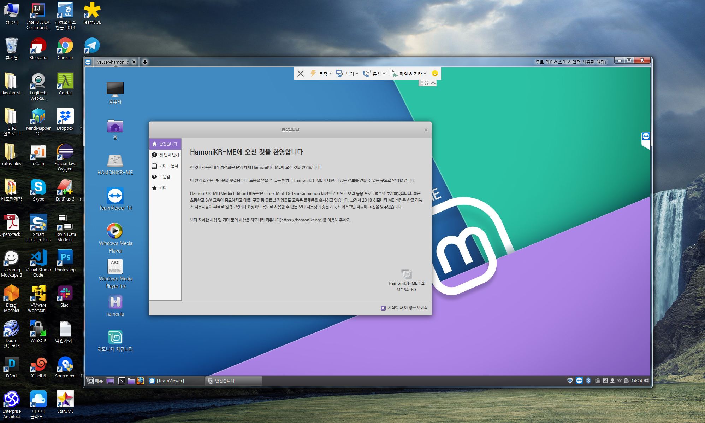
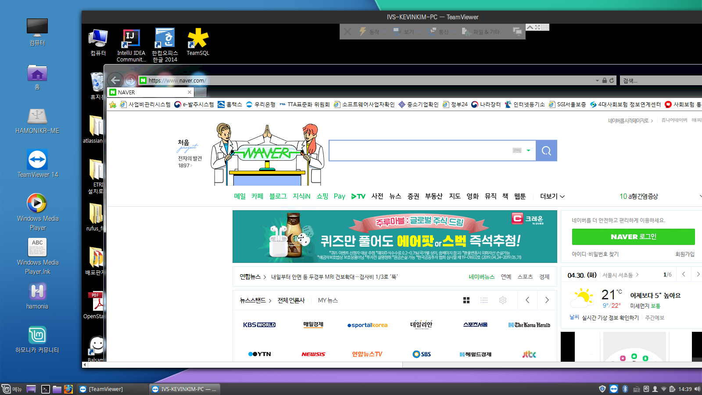

# 하모니카 리눅스 Teamviewer 원격관리

리눅스 민트 19 버전 이후로 이전에 제공되던 vino 패키지가 제거되면서

여전히 여러가지 방법으로 원격 접속을 관리할수 있지만, 기존에 있던 원격데스크톱 접속을 허용하는 쉬운설정이 메뉴에서 사라졌습니다.

그래서 이번에는 팀뷰어를 이용한 접속을 하였습니다.

팀뷰어는 리눅스용 버전을 공식 홈페이지에서 제공하고 있으며 하모니카에서 매우 안정적으로 구동됩니다.

* Teamviewer site : [https://www.teamviewer.com/en/download/linux/](https://www.teamviewer.com/en/download/linux/)

원격관리를 원하는 PC에서 팀뷰어를 설치하고, 원격으로 접속할 PC에서도 팀뷰어를 설치한 후&#x20;

언제나 접속할 수 있도록 설정을 추가해주면 다음과 같이 접속하여 원격 관리 작업이 가능합니다.

윈도우에서 하모니카 리눅스 PC 접속

하모니카 리눅스에서 윈도우 PC 접속

