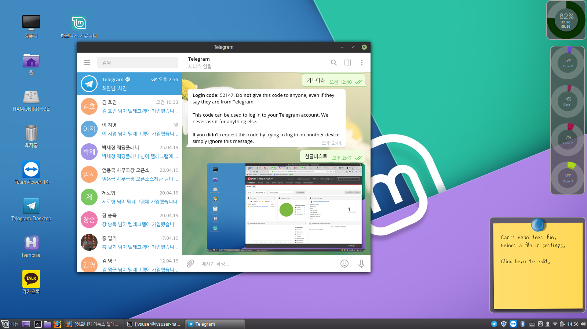

# 하모니카 리눅스 텔레그램 메신져

아래 텔레그램 프로젝트 사이트의 다운로드 링크에서 최신 버전을 다운로드

[https://github.com/telegramdesktop/tdesktop/releases](https://github.com/telegramdesktop/tdesktop/releases)

다운로드 받은 파일을 압축해제하면 다음과 같이 2개의 파일이 나오는데, 그 중 Telegram 명령어를 터미널에서 실행


또는 아래의 PPA를 추가하고 터미널에서 설치&#x20;



```
sudo add-apt-repository ppa:atareao/telegram
sudo apt update
sudo apt install telegram
```

잠시 시간이 지나고 설치가 완료되면 시작 메뉴에서 텔레그램을 실행


실행 후 휴대폰 번호를 입력하고 인증코드를 받아 텔레그램에 입력하면 보유한 친구목록과 함께 텔레그램 사용 가능

* 한글입력, 파일공유 등 기능 동일하게 제공됨



카카오톡 및 각종 메신져 사용 화면


