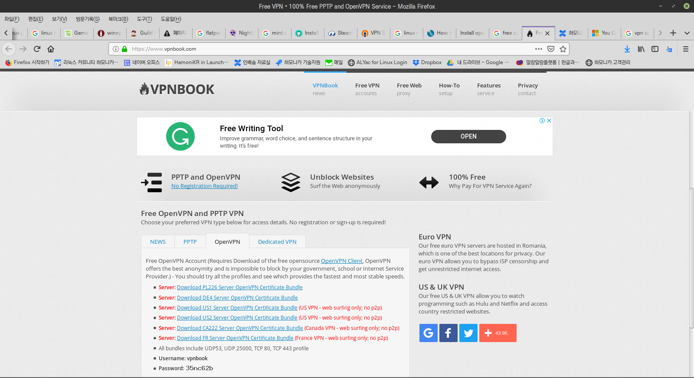
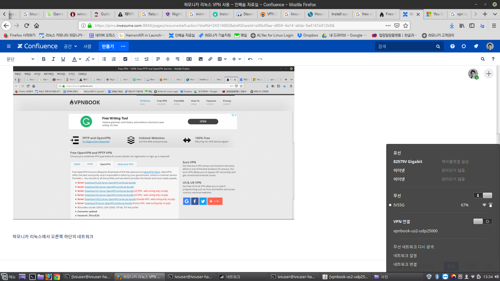
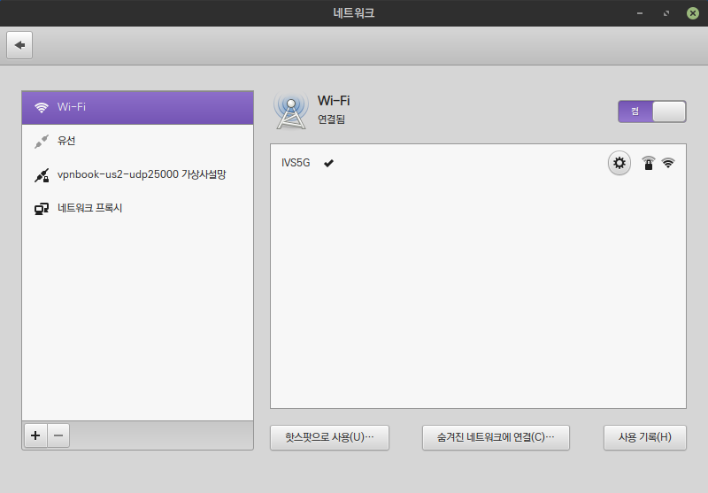
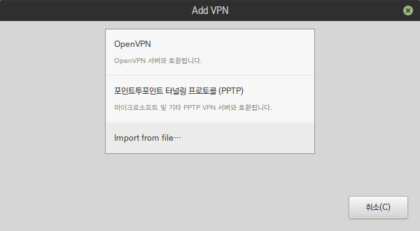
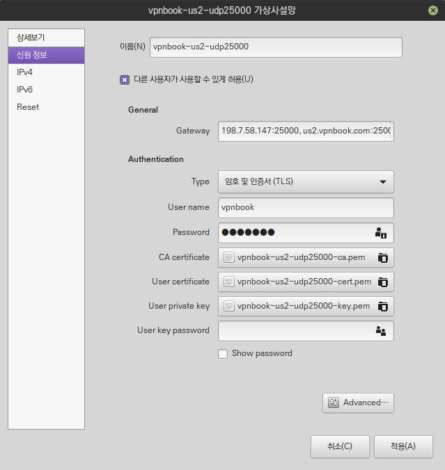

# 하모니카 리눅스 VPN 사용

vpn을 개인들이 필요로 하는 경우는 서비스 제공자가 ip 제약을 지역으로 해 둔 경우 우회하기 위해서 입니다.

구글에 free vpn 이라고 검색하면 여러 사이트에서 무료로 사용할 수 있는 vpn 서버를 제공하고 있으며 이를 이용하여 쉽게 설정 가능 합니다

구글에서 free vpn 이라고 검색해서 나온 사이트 중 아래의 사이트를 이용해서 접속해 보았습니다.

[https://www.vpnbook.com/](https://www.vpnbook.com/)

메인화면의 OpenVPN 탭을 선택하면 다음과 같은 화면이 나오는데, 여기서 접속을 원하는 서버를 누르시면 하모니카 에서 사용 가능한 openvpn 설정 파일을 다운로드 받을 수 있습니다.

파일을 다운로드 받고 난 후, 설정을 위해서 아래에 표시된 username 과 password 도 필요하니 메모해 두세요.

하모니카 리눅스에서 오른쪽 하단의 네트워크 아이콘을 클릭하면 네트워크를 설정할 수 있는 메뉴가 나옵니다.

여기서 vpn 접속을 설정하도록 하겠습니다.

vpn 네트워크 설정 화면

아래와 같은 네트워크 설정 화면이 나오면 왼쪽 하단의 + 모양 아이콘을 클릭합니다.

다운로드 받은 openvpn 설정 파일 불러오기

\+ 버튼을 누르면 아래와 같은 화면이 나오는데 이 때 Import frem file... 메뉴를 클릭하고,

다운로드 받은 vpn 설정 파일을 선택하시면 자동으로 필요한 설정이 채워지고 다음 화면으로 이동합니다.

아래와 같은 설정 화면에서 웹사이트에서 제공되는 아이디와 비밀번호를 아래 화면처럼 입력하고 적용 버튼을 누릅니다.

vpn 연결이 완료되고 이제 다른 IP로 접속이 가능합니다.

## 테스트에 사용한 openvpn 설정 파일 및 계정 정보 

(아래 정보는 서비스 제공자에 의해서 변경될 수 있으니 최신 정보를 이용하시기 바랍니다)

* [vpnbook-us2-udp25000.ovpn](https://app.gitbook.com/s/-MOdedbke\_kpJqE1CY2X/tips/A1/attachments/24314063/24314070.ovpn)
* username : vpnbook
* password : 35nc62b

## vpn 접속 관련 기술 문서 

* [https://www.bestvpnz.com/tutorials/how-to-set-up-openvpn-on-linux-with-detailed-linux-mint-tutorial/](https://www.bestvpnz.com/tutorials/how-to-set-up-openvpn-on-linux-with-detailed-linux-mint-tutorial/)
