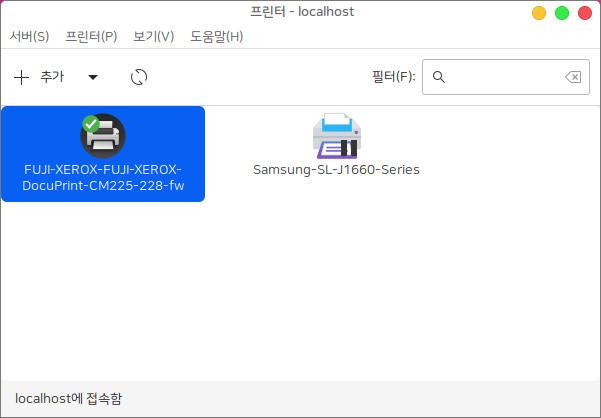
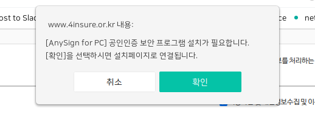
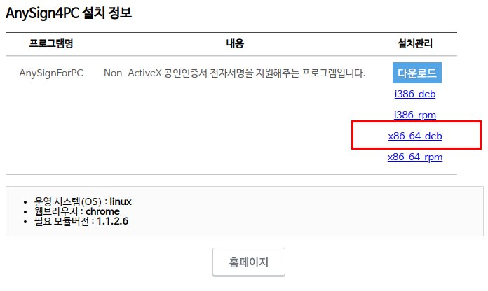
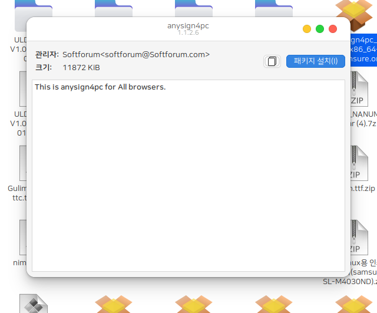
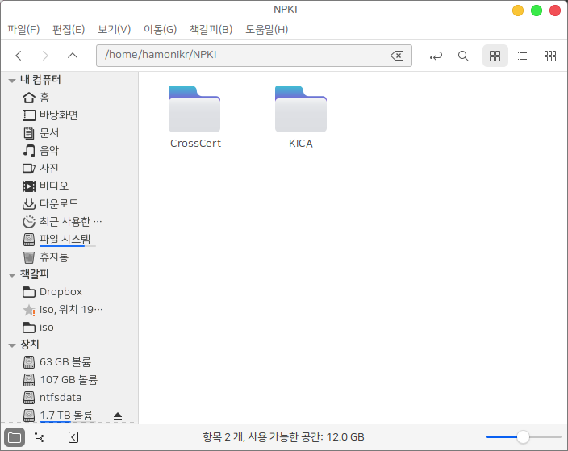

# 하모니카에서 주민등록등본, 4대보험가입증명서 출력하기

하모니카에서 주민등록등본, 4대보험가입증명서 출력하는 방법입니다.

2020년 11월 26일 하모니카 4.0에서 테스트 되었습니다.

서비스 제공 웹사이트의 플러그인 버전이 업그레이드 되거나 하는 경우에는 최신 버전의 파일을 다운로드 받아서&#x20;

## 1) 먼저 프린터가 정상으로 준비되어야 합니다 

## 2) 사이트에서 요구하는 공인인증서 플러그인을 설치합니다. 

사이트에 접속 후 공인인증서 로그인을 시도하면 접속을 위한 플러그인 설치 안내 화면이 나옵니다.

하모니카 사용자는 아래 표시한 x86\_64.deb 파일을 다운로드 받으세요.

직접 다운로드 받으려면 아래 주소를 이용 (웹사이트 제공자에 따라 이 주소는 변경될 수 있습니다.)

[https://download.softforum.com/Published/AnySign/v1.1.2.6/anysign4pc\_linux\_x86\_64.deb](https://download.softforum.com/Published/AnySign/v1.1.2.6/anysign4pc\_linux\_x86\_64.deb)

다운로드 받은 파일을 더블 클릭하면 다음과 같은 설치화면이 나옵니다.

패키지 설치 버튼을 눌러서 설치하세요.

## 3) 공인인증서를 아래 경로에 복사합니다. 

윈도우10 기준 공인인증서 저장 위치는 c 드라이브 > 사용자(USER) > 내 계정 > AppData > LocalLOW > NPKI 에 저장됩니다.

이 NPKI 폴더를 복사해서 하모니카의 /home/사용자아이디/ 경로에 복사합니다.

## 4) 필요한 서류를 발급할 사이트에 접속해서 공인인증서 로그인을 합니다. 

### 주민등록등본 신청하기 

[https://www.gov.kr/mw/AA020InfoCappView.do?CappBizCD=13100000015\&HighCtgCD=A01010001\&Mcode=10200](https://www.gov.kr/mw/AA020InfoCappView.do?CappBizCD=13100000015\&HighCtgCD=A01010001\&Mcode=10200)

### 4대사회보험 정보연계센터 개인 비회원 이용서비스 로그인 

[https://www.4insure.or.kr/ins4/ptl/memb/entr/NoBodyLogin.do?isInstall=1](https://www.4insure.or.kr/ins4/ptl/memb/entr/NoBodyLogin.do?isInstall=1)

원하는 서류를 신청하고 발급하면 정상적으로 출력됩니다.

