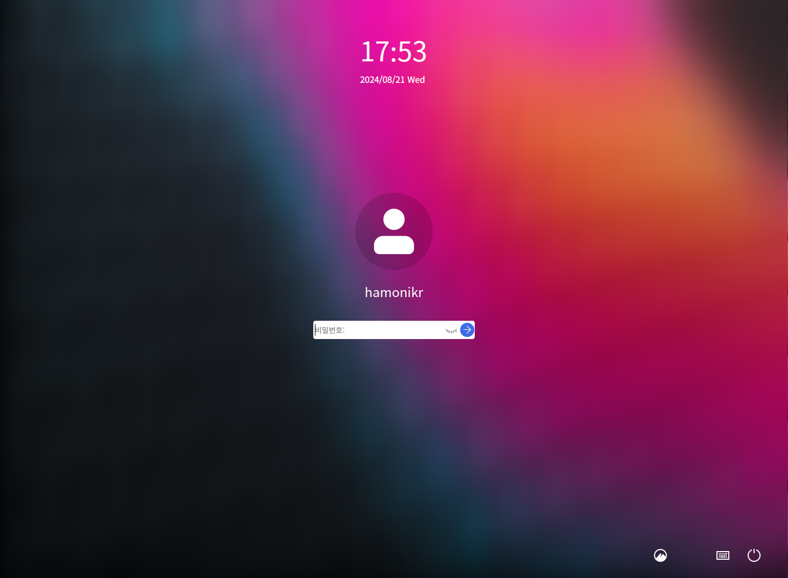

# Ubuntu에서 하모니카(Hamonikr)로 업그레이드

## ubuntu-hamonikr-respin이란?

HamoniKR OS는 Ubuntu 계열의 OS를 사용하는 사용자들에게 편의성을 제공하기 위해서 Cinnamon 환경의 테스크톱 환경 개선 및 HamoniKR OS 만의 테마와 배경화면을 제공합니다.&#x20;

또한,  한글 문서 사용자들을 위한 오피스도구, 빠른 검색과 실행을 위한 퀵서치 도구, 파일 관리에 필요한 다양한 Nemo Plugins, 터미널 환경에서 파일 찾기 및 수정이 가능한 도구,  그리고 시스템 관리 및 편의성을 위한 다양한 도구를 제공합니다.&#x20;

(일부 하모니카 OS 전용 기능들은 호환되지 않을 수 있습니다.)


## 1. HamoniKR 데스크톱 환경 사용법.

```
# HamoniKR APT 저장소 추가. 
wget -qO- https://repo.hamonikr.org/hamonikr.apt | sudo -E bash -
 
# HamoniKR 데스크톱 환경 설치.
sudo apt-get install -y ubuntu-hamonikr-respin
```

설치 도중 gdm 과 lightdm 을 선택하는 화면이 보이면 lightdm 을 선택합니다.

네트워크 환경에 따라 시간이 다소 소요됩니다.

모든 설치가 완료되면 시스템을 재시작하세요.

<figure><figcaption><p>plymouth</p></figcaption></figure>

로그인 화면

<figure><figcaption></figcaption></figure>

## 2. HamoniKR 테스크톱 환경에서 제공되는 기능

#### 1. 테스크톱 환경 개선

* Gnome 테스크톱 환경에서 직관적인 인터페이스와 사용자에게 친화적인 Cinnamon 테스크톱 환경으로  기본 메시지 및  모든 인터페이스 요소들을 최적화하기 위한 환경을 제공합니다.&#x20;
* HamoniKR OS만의 테마와 배경화면을 제공 합니다.&#x20;
*   Nemo 파일 관리자의 확장 기능을 통해 다양한 기능을 사용하실 수 있습니다.&#x20;

    &#x20;\- 두 파일 or 폴더 비교 기능.

    &#x20;\- 파일 및 폴더에 엠플럼 추가 기능.

    &#x20;\- 인코딩 오류 수정 기능.

    &#x20;\- 이미지 변환 및 크지 조절 기능.

    &#x20;\- Samba를 통한 파일 및 폴더 공유 기능.
*   터미널 환경 개선

    &#x20;\- 리눅스 터미널의 환경을 개선해주는 쉘 스크립트 제공  (Hamonikr-zsh)
* MackOS의 Dock의 기능과 유사한 애플리케이션 제공 (Plank Dock)

#### 2. 편의 향상을 위한 다양한 기능 도구

1.  시스템 관리 도구.

    * 여러개의 커널을 사용하는 사용자들을 위한 커널 관리도구. (Boot-select)
    * 시스템 안전을 위한 백업관리 도구 (Hamonikr Backup)
    * 시스템 정보를 확인할 수 있는 도구 (HardInfo, Neofetch, Stacer)


2.  손쉬운 파일 및 폴더 관리 도구.

    * GUI 기반으로 파일이나 폴더 명의 이름을 한번에 변경할 수 있는 도구 (Gprename)
    * 한글 사용자들을 위한 오피스 도구. (LibreOffice)
    * 코드나 테스트 작성, 편집시 빠르게 작업하고자 할때 사용가능한 도구. (Gedit)
    * HamoniKR OS  사용자들을 위한 클라우드 저장소. (Hamonikr-Drive)
    * 터미널 환경에서 파일의 검색 및 내용을 수정할 수 있는 도구 (Hamonikr-ff)


3.  사운드 및 비디오 사용을 위한 도구.

    * 다양한 포멧과 코덱을 지원하는 비디오 플레이어 (Celluloid, )
    * TV 프로그램과 영화를 스트리밍 할 수 있는 IPTV 스트리밍 (Hypnotix)
    * 앨범 아트와 가사를 포함하여 음악 컬렉션을 관리하고 재생할 수 있는 음악 플레이어 (Lollypop)


4.  개발을 위한 도구.

    * 분산 버전 관리를 위한 소스코드 관리 도구 (Git, Hamonikr-nemo-rabbitvcs)
    * 리모트 테스크톱 세션 관리(SSH, RDP, VNC등)을 위한 도구 (Asbru-cm)


5. 기타 유용한 도구.
   * 부팅 USB 제작을 위한 도구 (Balena-etcher, Ventoy)
   * 손쉬운 스크린샷 캡쳐와 편집 작업을 위한 도구 (Shutter)
   * 시스템에 등록된 애플리케이션을 빠르게 시작하거나 문서등을 검색할 수 있는 도구 (Albert)
   * 가상키보드 한글 지원 (Onboard)
   * 각 사이트별 아이디 및 패스워드 관리 프로그램 (KeePassX)


