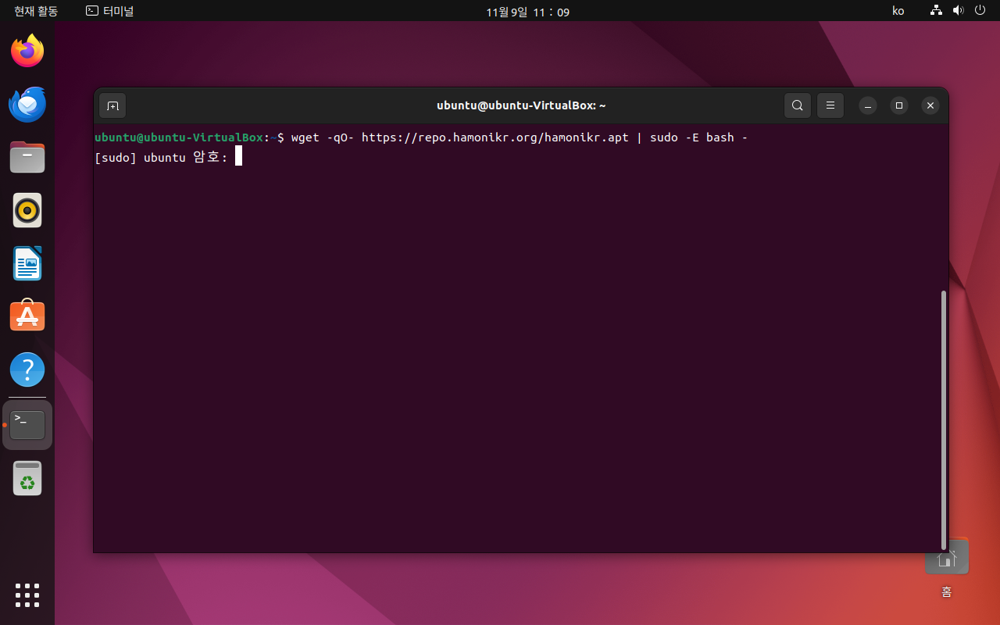
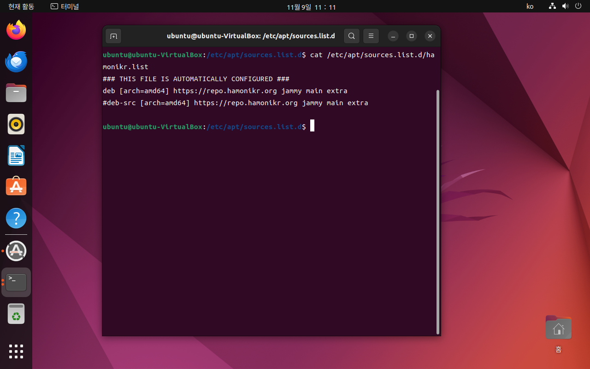
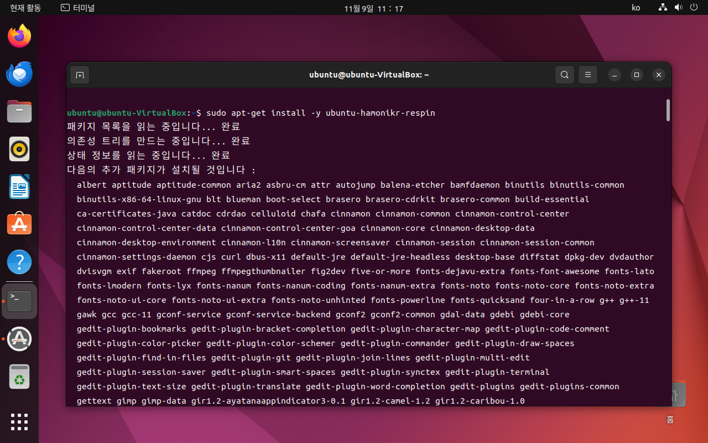

# 업그레이드 방법

## Ubuntu에서  HamoniKR 7.0으로 데스크톱 환경으로 변경하기.

## 1. Ubuntu-HamoniKR-Respin 페키지 설치.

```
# HamoniKR APT 저장소 추가. 
wget -qO- https://repo.hamonikr.org/hamonikr.apt | sudo -E bash -
 
# HamoniKR 데스크톱 환경 설치.
sudo apt-get install -y ubuntu-hamonikr-respin

```


터미널에서 아래 명령어로 Hamonikr 저장소를 추가합니다.&#x20;

* ```
  $ wget -qO- https://repo.hamonikr.org/hamonikr.apt | sudo -E bash -
  ```

<figure><figcaption></figcaption></figure>

* 추가된 HamoniKR APT  저장소는 아래와 같이 확인을 하실 수 있습니다.&#x20;

<figure><figcaption></figcaption></figure>


HamoniKR 저장소 추가가 완료되었으면, Ubuntu-Hamonikr-Respin 패키지를 설치합니다.&#x20;

* Ubuntu-Hamonikr-respin 패키지는 HamoniKR 7.0 KumKang 버전에 사용되고 있는 패키지들을 한번에 설치할 수 있도록 도와주는 패키지입니다.&#x20;

```
# HamoniKR 데스크톱 환경 설치.
sudo apt-get install -y ubuntu-hamonikr-respin
```

Ubuntu-Hamonikr-Respin을 설치를 진행하시면 아래 화면과 같이 설치 진행이됩니다.

<figure><figcaption></figcaption></figure>


설치 진행 중 Default Display Manager 을 위한  패키지 설정창이 나옵니다.&#x20;

`gdm3`와 `lightdm`는 Linux 시스템에서 사용되는 두 가지 인기 있는 디스플레이 매니저입니다. 디스플레이 매니저는 그래픽 사용자 인터페이스(GUI)를 통해 사용자가 로그인할 수 있게 하는 애플리케이션입니다.

**원하시는 디스플레이 메니저를  gdm3 또는 lightdm 을 선택해주세요.**

( 참고로 Ubuntu는 gdm3를 기본 디스플레 메니저, HamoniKR은 Lightdm을 기본 디스플레이 메니저)

<figure><figcaption></figcaption></figure>

지금부터 잠시 동안 게임한판 하시면서 기다려주세요..png>)

이제 설치가 완료되었습니다. 재부팅해주세요.

<figure><figcaption></figcaption></figure>


#### 디스플레이 메니저를 Lisghtdm으로 설정한 경우

<figure><figcaption></figcaption></figure>

<figure><figcaption></figcaption></figure>

#### 디스플레이 메니저를 gdm3로 설정한 경우&#x20;

<figure><figcaption></figcaption></figure>

<figure><figcaption></figcaption></figure>


