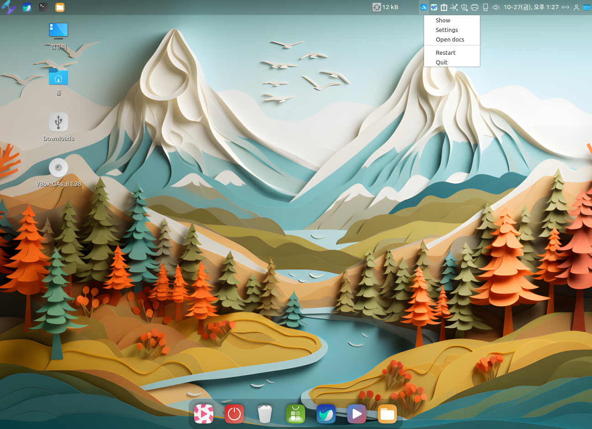

# Albert (데스크탑 검색 및 런처 )

Albert는 데스크탑 검색 및 애플리케이션 런처입니다.&#x20;

이 프로그램은 Mac OS의 Spotlight나 Windows의 Cortana와 유사한 기능을 제공합니다.&#x20;

사용자는 키보드 단축키(CTRL+Space)를 눌러 Albert를 활성화하고,&#x20;

**파일, 애플리케이션, 웹 페이지, 셸 명령 및 기타 많은 항목을 빠르게 검색하거나 시작할 수 있습니다.**

Albert의 주요 기능은 다음과 같습니다:

1. **빠른 애플리케이션 런처**: 프로그램 이름의 일부를 입력하여 빠르게 애플리케이션을 시작할 수 있습니다.
2. **파일 검색**: 시스템 내의 파일 및 폴더를 쉽게 찾을 수 있습니다.
3. **웹 검색**: 다양한 웹 검색 엔진을 통해 인터넷 검색을 바로 시작할 수 있습니다.
4. **계산기**: 간단한 수학 계산을 바로 수행할 수 있습니다.
5. **플러그인 지원**: 다양한 플러그인을 통해 기능을 확장할 수 있습니다. 예를 들어, 단위 변환, 날씨 정보, 딕셔너리 검색 등의 기능을 추가할 수 있습니다.

### Albert 실행하기

* Ablert 실행 단축키는 **Ctrl + Space** 입니다.&#x20;

<figure><figcaption></figcaption></figure>

### Albert 설정하기.

Albert( Ctrl + Space) 실행된 화면에서 우측 설정 아이콘을 클릭합니다.&#x20;

또는 작업 표시줄의 Albert 아이콘에서 마우스 우측 버튼으로 설정을 할 수 있습니다.&#x20;

<figure><figcaption></figcaption></figure>

 

<figure><figcaption></figcaption></figure>

General 탭에서는 Albert 실행 단축키를 변경할 수 있으니 원하시는 단축키로 지정해서 사용하세요\~

<figure><figcaption></figcaption></figure>

Extensions 탭에서는 플러그인을 관리할 수 있습니다.&#x20;

* WebSearch 정보를 보시면 숏명령어로 Google이나  Naver에 검색을 실행 할 수 있어 브라우저를 실행해서 검색하는 수단이 간편해집니다.&#x20;

<figure><figcaption></figcaption></figure>

