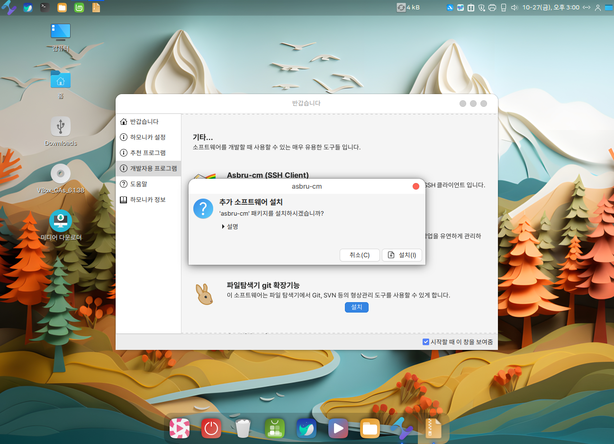
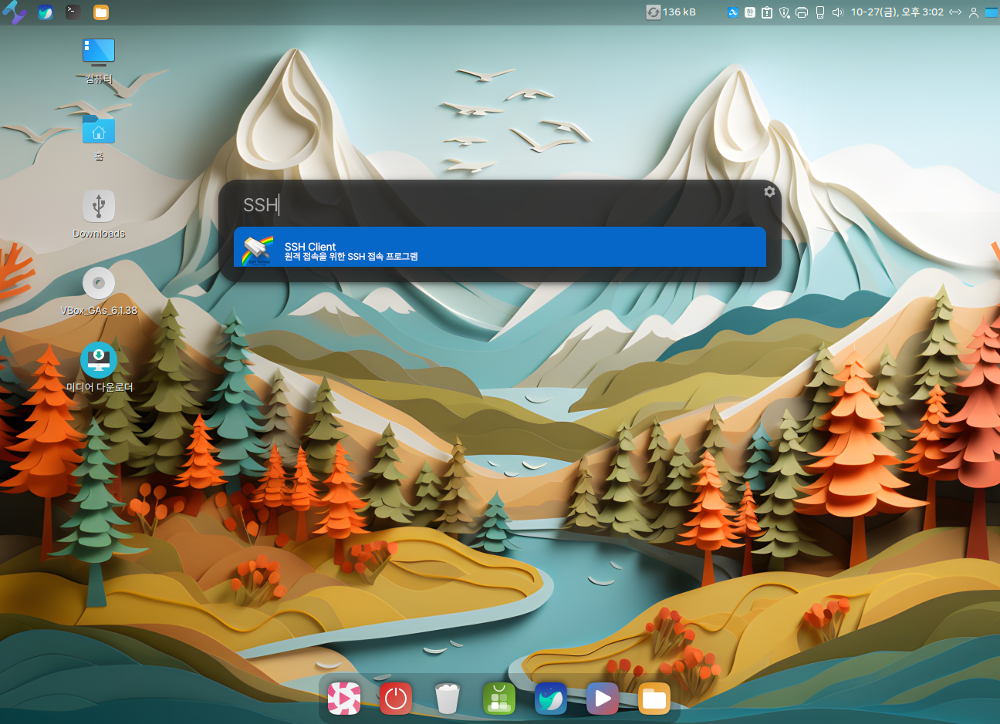
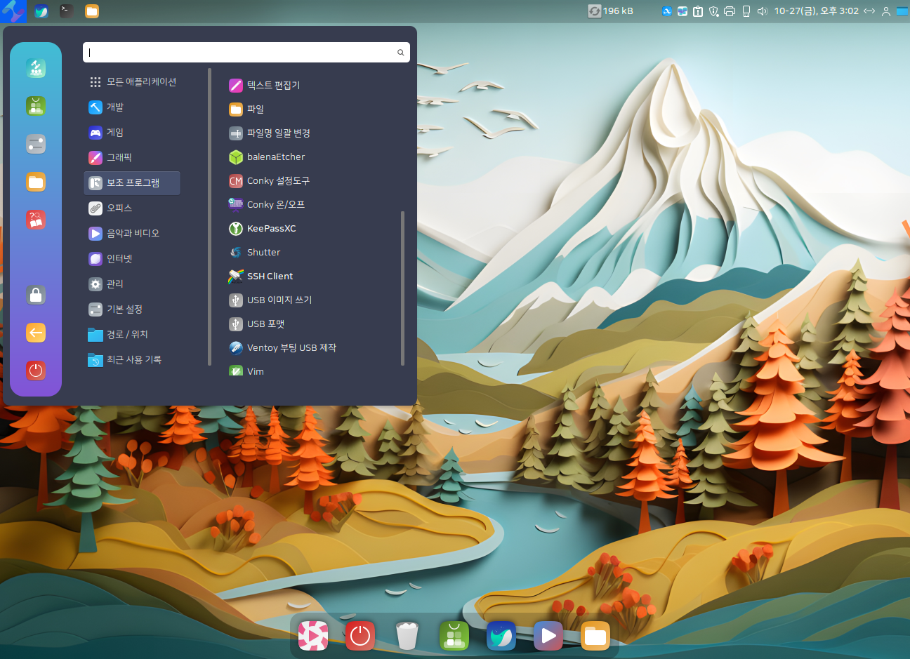

# Asbru-cm (SSH-client)

Asbru-cm(SSH Client) 프로그램은 멀티 SSH 세션을 관리하는 프로그램입니다.&#x20;

<figure><figcaption></figcaption></figure>

<figure><figcaption></figcaption></figure>

### Asbru 설치하기.

#### Gui 설치 방법.

Albert (alt + space) 또는 프로그램 메뉴 > 기본설정 > 환영합니다를 실행합니다.&#x20;

<div>

<figure><figcaption></figcaption></figure>

 

<figure><figcaption></figcaption></figure>

</div>

환영합니다(반갑습니다) 프로그램에서 개발자용 프로그램 > Asbru-cm( SSH Client)의 실행 버튼을 클릭하면 설치를 시작하실 수 있습니다.&#x20;

<figure><figcaption></figcaption></figure>

<div>

<figure><figcaption></figcaption></figure>

 

<figure><figcaption></figcaption></figure>

</div>

#### Tui 설치 방법

```
$ sudo apt-get update 
$ sudo apt-get install -y asbru-cm
```

### 2. Asbru-cm (SSH Client) 실행하기.

Albert ( alt + space )에서 SSH Client 입력 후 실행하시거나 프로그램 메뉴 > 보조프로그램  > SSH Client를 실행 할 수 있습니다.&#x20;

<div>

<figure><figcaption></figcaption></figure>

 

<figure><figcaption></figcaption></figure>

</div>

### 3. Asbru-cm (SSH Client) 인터페이스

*   Asbru-cm을 시작하면 다음 이미지와 유사한 표준 인터페이스가 표시됩니다.

    

    **(1) 정보 탭**

    * 시작 시 첫 번째 연결을 생성하는 방법에 대한 일반적인 지침이 제공됩니다.
    * 연결을 선택/열면 메모를 입력하고 저장할 수 있습니다.

    **(2) 통계**

    * 이 섹션에는 사용량에 대한 일부 통계가 표시됩니다.

    **(3) 스크린샷**

    * 이 섹션에는 현재 저장된 스크린샷의 썸네일이 표시됩니다.

    **(4) 기존 연결**

    * **상단 툴바** : 왼쪽에서 오른쪽으로
      * 새 그룹 만들기
      * 새 연결 구성 만들기
      * 기존 연결 편집
      * 연결 목록에서 노드 이름 바꾸기(그룹 또는 연결 이름을 바꿀 수 있음)
      * 현재 노드(그룹/연결) 삭제
    * **사이**
      * 이 탭에는 현재 구성된 모든 연결이 표시됩니다.
        * 세션을 시작하려면 기존 연결을 두 번 클릭하세요.
        * 하위 그룹을 확장/축소하려면 그룹을 두 번 클릭하세요. - 노드를 선택하고 마우스 오른쪽 버튼을 클릭하면 현재 노드에 사용 가능한 옵션이 포함된 팝업 메뉴가 표시됩니다.
    * **즐겨찾기**
      * 즐겨찾는 연결로 표시한 연결 목록
    * **역사**
      * 최근에 열어야 하는 세션 목록
    * **클러스터**
      * 현재 구성된 클러스터 목록(클러스터는 동시에 열리고 키 입력 및 마우스 이벤트를 공유하는 연결 그룹입니다)

    **(5) 환경설정**

    * 동작, 모양을 사용자 정의하고 특정 요구 사항에 맞게 일부 작업을 조정할 수 있는 구성 설정에 액세스합니다.


### 4. SSH 연결 만들기

* Asbru-cm의 좌측 상단위 "Add a new connection" 아이콘을 클릭을 하신 후 "Enter new Name" 입력란에 연결하실 SSH의 정보를 입력을 하고 "확인" 버튼을 클릭합니다.&#x20;

<figure><figcaption></figcaption></figure>

* 연결하실 PC의 SSH 정보를 입력 하신 후 "Save and Close" 버튼을 클릭합니다.&#x20;

<figure><figcaption></figcaption></figure>

* 좌측 화면창에 연결된 SSH pc의 정보가 나열되며, 하단의 "Connection" 버튼을 클릭하시거나, 마우스 더블 클릭으로 연결하여 사용하실 수 있습니다.&#x20;

<figure><figcaption></figcaption></figure>


### 5. 연결 목록 편집

#### 연결이나 전체 그룹을 트리의 한 위치에서 다른 위치로 이동하는 것입니다. <a href="#to-move-a-connection-or-full-group-from-one-place-in-the-tree-to-another" id="to-move-a-connection-or-full-group-from-one-place-in-the-tree-to-another"></a>

1. 연결 또는 전체 그룹 선택
2. `<Ctrl-X>`노드를 자르려면(또는 잘라내기를 마우스 오른쪽 버튼으로 클릭)
3. `<Ctrl-V>`노드를 새 위치에 붙여넣기

#### 일부 매개변수를 대체할 수 있도록 기존 연결을 복사하려면[¶](https://docs.asbru-cm.net/Manual/QuickStart/#to-copy-an-existing-connection-so-you-can-replace-some-parameters) <a href="#to-copy-an-existing-connection-so-you-can-replace-some-parameters" id="to-copy-an-existing-connection-so-you-can-replace-some-parameters"></a>

1. 연결 선택
2. `<Ctrl-C>`노드를 복사하려면(또는 복사를 마우스 오른쪽 버튼으로 클릭)
3. `<Ctrl-V>`노드를 새 위치에 붙여넣기

#### 기존 연결을 복제하려면[¶](https://docs.asbru-cm.net/Manual/QuickStart/#to-clone-an-existing-connection) <a href="#to-clone-an-existing-connection" id="to-clone-an-existing-connection"></a>

1. 연결 선택
2. `<Ctrl-D>`연결을 복제하려면(또는 연결 복제를 마우스 오른쪽 버튼으로 클릭)

\
